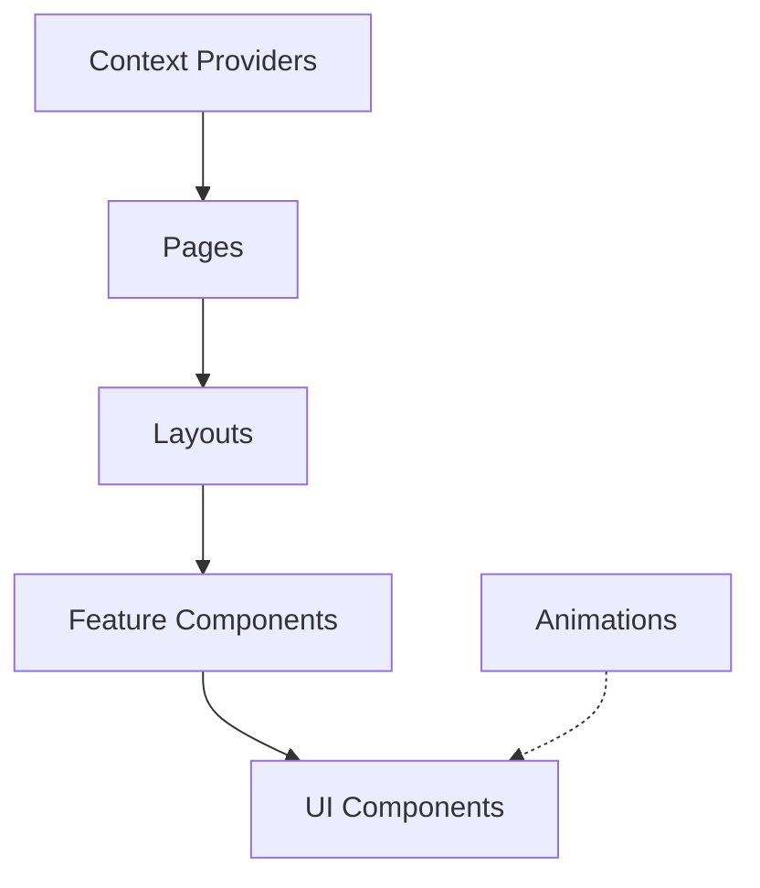

# Component Architecture

## Overview

This document outlines the component architecture used throughout the Triviape application. It covers component hierarchy, organization principles, and recommended patterns.

## Component Hierarchy



## Component Organization

The application organizes components into several categories:

### 1. Page Components

Located in `/app/` directory, these components define the routes and overall page structure.

```
/app
├── page.tsx           # Home page
├── dashboard/
│   └── page.tsx       # Dashboard page
├── quiz/
│   └── page.tsx       # Quiz page
└── ...
```

### 2. Layout Components

Located in `/app/components/layouts`, these components provide consistent layout structures.

```
/app/components/layouts
├── MainLayout.tsx
├── DashboardLayout.tsx
└── ...
```

### 3. Feature Components

Located in various feature-specific directories, these components implement specific application features.

```
/app/components/quiz
/app/components/daily
/app/components/auth
```

### 4. UI Components

Located in `/app/components/ui`, these are reusable UI elements used throughout the application.

```
/app/components/ui
├── Button.tsx
├── Card.tsx
└── ...
```

### 5. Animation Components

Located in `/app/components/animation`, these handle visual animations.

```
/app/components/animation
├── rive-animation.tsx
└── ...
```

## Optimization Patterns

### Memoization

Components with expensive rendering should be memoized using the `memoWithPerf` utility:

```tsx
const MemoizedComponent = memoWithPerf(ExpensiveComponent, {
  name: 'ExpensiveComponent',
  warnAfterRenders: 3
});
```

### Performance Monitoring

All components should include appropriate performance monitoring:

```tsx
const metrics = useBenchmark({
  name: 'ComponentName',
  threshold: 30
});
```

## Component API Guidelines

1. **Props Interface**: All components should define a clear props interface
2. **Default Props**: Use default parameter values rather than defaultProps
3. **Composition**: Prefer composition over inheritance
4. **Forwarded Refs**: Use forwardRef for components that need to accept refs

## Additional Resources

- [Memoization Patterns](../patterns/component-patterns/memoization.md)
- [Composition Patterns](../patterns/component-patterns/composition.md)
- [Performance Strategy](./performance-strategy.md)

<!-- 
@schema: {
  "type": "architecture_document",
  "version": "1.0",
  "sections": ["overview", "hierarchy", "organization", "optimization", "guidelines", "resources"]
}
--> 