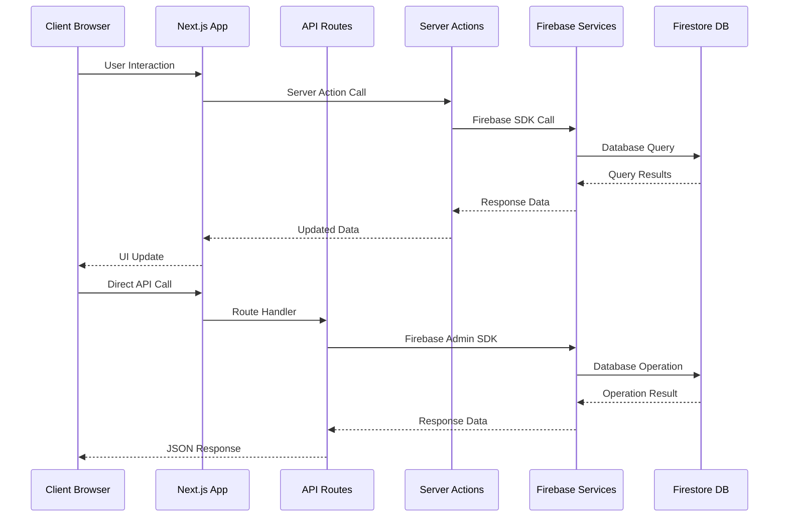
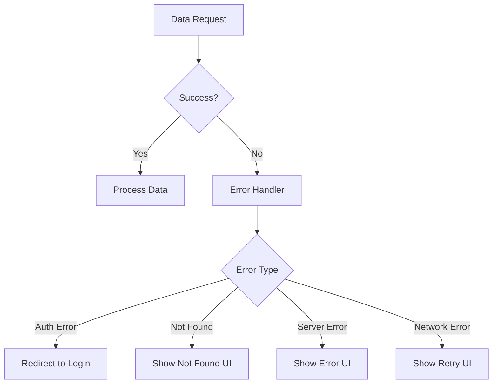

# Data Flow Architecture

## Overview

This document outlines the data flow architecture of the Triviape application, demonstrating how data moves through the system from data sources to the user interface.

## Data Flow Diagram



## Data Sources

### 1. Firestore Database

Primary data store for application data:

- User profiles
- Quiz content
- User progress
- Game statistics

### 2. Firebase Authentication

User authentication and profile data:

- User credentials
- Basic profile information
- Authentication state

### 3. Firebase Storage

Binary and media storage:

- User profile images
- Quiz media content
- Animation assets

## Data Access Patterns

### Server-Side Data Access

Server Components and API Routes access data directly from Firebase:

```tsx
// Server component data fetching
async function DashboardPage() {
  const quizzes = await fetchUserQuizzes(userId);
  return <Dashboard quizzes={quizzes} />;
}

// API route data access
export async function GET(request: Request) {
  const quizzes = await fetchQuizzes();
  return Response.json({ quizzes });
}
```

### Client-Side Data Access

Client Components access data through:

1. **Props from Server Components**: Pre-fetched data passed down
2. **React Query**: For client-side data fetching and caching
3. **Server Actions**: For data mutations

```tsx
// Client-side data fetching with React Query
function useQuizData(quizId: string) {
  return useQuery({
    queryKey: ['quiz', quizId],
    queryFn: () => fetchQuiz(quizId)
  });
}

// Server action for data mutation
async function submitQuizAnswer(quizId: string, answer: Answer) {
  'use server';
  await saveQuizAnswer(quizId, answer);
  revalidatePath(`/quiz/${quizId}`);
}
```

## Data Flow Optimization

### Caching Strategy

1. **React Query Cache**: Client-side data cache
2. **Next.js Cache**: Route and fetch caching
3. **Firebase Cache**: SDK-level caching

### Data Prefetching

1. **Static Generation**: Pre-render static content
2. **On-demand Revalidation**: Update stale data
3. **Parallel Data Fetching**: Fetch multiple resources simultaneously

## Error Handling

### Error Flow



### Error Handling Patterns

1. **Server-Side Errors**: Handled at the API/server component level
2. **Client-Side Errors**: Handled with React Query error states
3. **Global Error Handling**: React Error Boundaries for UI errors

## Additional Resources

- [API Error Handling Patterns](../patterns/api-patterns/error-handling.md)
- [Data Fetching Patterns](../patterns/api-patterns/data-fetching.md)
- [Caching Strategies](../patterns/api-patterns/caching.md)

<!-- 
@schema: {
  "type": "architecture_document",
  "version": "1.0",
  "sections": ["overview", "diagram", "sources", "patterns", "optimization", "error_handling", "resources"]
}
--> 