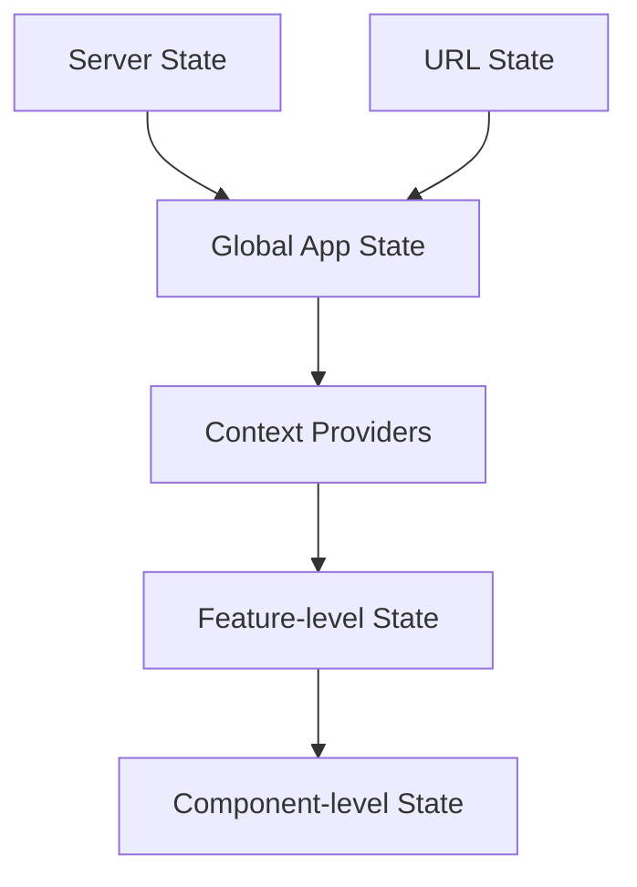

# State Management Architecture

## Overview

This document outlines the state management architecture used in the Triviape application. It covers the different approaches to state management and when to use each.

## State Management Strategy

The application uses a multi-layered state management approach:



## State Categories

### 1. Global App State

Managed through React Context and used for application-wide data.

```tsx
// Example from the responsive UI context
export const ResponsiveUIProvider: React.FC<Props> = ({ children }) => {
  const [animationLevel, setAnimationLevel] = useState<AnimationLevel>('full');
  const [deviceInfo, setDeviceInfo] = useState<DeviceInfo>(defaultDeviceInfo);
  
  // ... context implementation
  
  return (
    <ResponsiveUIContext.Provider value={contextValue}>
      {children}
    </ResponsiveUIContext.Provider>
  );
};
```

### 2. Feature-level State

State that's specific to a feature but shared across multiple components within that feature.

```tsx
// Example feature-level state hook
export function useQuizState() {
  const [currentQuestion, setCurrentQuestion] = useState(0);
  const [answers, setAnswers] = useState<Answer[]>([]);
  
  // ... state management logic
  
  return {
    currentQuestion,
    answers,
    selectAnswer,
    nextQuestion,
    previousQuestion
  };
}
```

### 3. Component-level State

State that's specific to a single component.

```tsx
// Example component-level state
function QuestionCard() {
  const [isExpanded, setIsExpanded] = useState(false);
  
  // ... component implementation
}
```

### 4. Server State

State that's fetched from a server, managed with React Query.

```tsx
// Example server state with React Query
function useUserQuizzes() {
  return useQuery({
    queryKey: ['quizzes', userId],
    queryFn: () => fetchUserQuizzes(userId),
    staleTime: 5 * 60 * 1000 // 5 minutes
  });
}
```

### 5. URL State

State that's derived from the URL.

```tsx
// Example URL state
function QuizPage() {
  const params = useParams();
  const quizId = params.quizId;
  
  // ... component implementation
}
```

## State Management Guidelines

1. **Context Providers**: Use for truly global state that many components need
2. **Component Co-location**: Keep state as close as possible to where it's used
3. **Prop Drilling**: Avoid passing props through more than 2 levels
4. **State Derivation**: Derive state when possible rather than duplicating
5. **Immutability**: Always maintain immutability when updating state

## Performance Considerations

1. **Context Splitting**: Split contexts to avoid unnecessary re-renders
2. **Selector Usage**: Use selectors to access only needed state
3. **Memoization**: Memoize expensive computations derived from state

## Additional Resources

- [State Hooks Patterns](../patterns/hooks-patterns/state-hooks.md)
- [Data Flow Architecture](./data-flow.md)
- [Component Architecture](./component-architecture.md)

<!-- 
@schema: {
  "type": "architecture_document",
  "version": "1.0",
  "sections": ["overview", "strategy", "categories", "guidelines", "performance", "resources"]
}
--> 