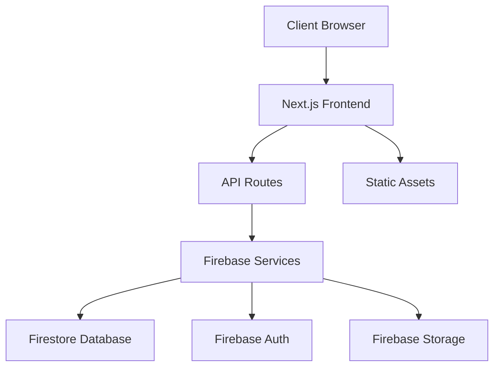

# System Overview

## Introduction

This document provides a high-level overview of the Triviape application architecture. It outlines the main components, their responsibilities, and how they interact.

## System Architecture

## Core Components

### Frontend Layer

- **Next.js Application**: Server-side rendered React application
- **Client Components**: Interactive UI elements
- **Server Components**: Data fetching and processing

### API Layer

- **Next.js API Routes**: Backend endpoints for data operations
- **Server Actions**: Direct server-side operations

### Data Layer

- **Firebase**: Main backend service provider
- **Firestore**: NoSQL database for application data
- **Authentication**: User identity and access management

## Performance Strategy

The application employs several strategies to ensure optimal performance:

1. **Component Optimization**: Memoization and lazy loading
2. **Adaptive Rendering**: Device-specific performance adjustments
3. **Cache Management**: Strategic data caching

## Security Architecture

1. **Authentication**: Firebase Auth with secure sessions
2. **Authorization**: Role-based access control
3. **Data Validation**: Server-side validation of all inputs

## Additional Resources

- [Component Architecture](./component-architecture.md)
- [Data Flow](./data-flow.md)
- [Performance Strategy](./performance-strategy.md)

<!-- 
@schema: {
  "type": "architecture_document",
  "version": "1.0",
  "sections": ["introduction", "system_architecture", "components", "performance", "security", "resources"]
}
--> 