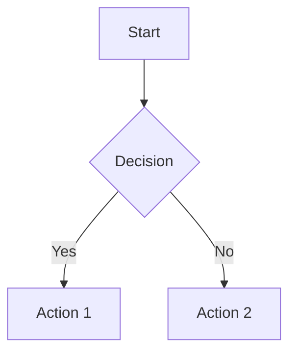

# Documentation Standards

## Overview

This document outlines the standards and guidelines for creating and maintaining documentation in the Triviape project. Following these standards ensures consistency, accessibility, and usefulness of documentation.

## Documentation Types

The documentation system includes the following types of documents:

1. **Architecture Documents**: High-level system and component architecture
2. **Pattern Documents**: Code patterns and implementation guidelines
3. **Reference Documents**: Component, hook, and utility API references
4. **Guide Documents**: Step-by-step guides for developers and operations
5. **Decision Records**: Records of architectural decisions with context and rationale
6. **Standards Documents**: Coding standards and guidelines

## Document Structure

### Frontmatter

All documentation files must include YAML frontmatter with the following fields:

```yaml
---
title: Document Title
description: Brief description of the document
created: YYYY-MM-DD
updated: YYYY-MM-DD
author: Author Name or Team
status: draft | review | approved | deprecated
tags: [tag1, tag2, tag3]
related:
  - related-document-1.md
  - related-document-2.md
---
```

### Content Structure

Documentation should follow a consistent structure:

1. **Title**: Main document title (H1)
2. **Overview**: Brief introduction to the document topic
3. **Main Content**: Organized in sections with clear headings
4. **Additional Resources**: Links to related resources
5. **Machine-Readable Metadata**: Schema reference at the end of the document

## Formatting Guidelines

### Markdown Conventions

- Use ATX-style headings with a space after the hash (`# Heading`)
- Use backticks for inline code and code blocks with language specification
- Use link references instead of inline links for better maintainability
- Use numbered lists for sequential steps and bullet points for unordered lists
- Use bold for emphasis and italics for definitions or terminology
- Use blockquotes for important notes or quotes

### Code Examples

- Always specify the language for code blocks
- Include comments in code examples to explain key points
- Keep code examples concise and focused on the specific concept
- Match code examples to the actual codebase patterns
- Include both good and bad examples when explaining a pattern

```tsx
// ✅ GOOD: Clear, focused code example
function Button({ children, onClick }) {
  return (
    <button 
      className="btn" 
      onClick={onClick}
    >
      {children}
    </button>
  );
}

// ❌ BAD: Unnecessarily complex or unclear example
function Button(props) {
  const { children, ...rest } = props;
  return <button {...rest}>{children}</button>;
}
```

### Diagrams

- Use Mermaid.js for diagrams when possible
- Include alt text or descriptions for all diagrams
- Keep diagrams simple and focused on key concepts
- Use consistent styling across all diagrams



## Machine-Readable Documentation

### Documentation Schemas

Documentation should include machine-readable metadata in a schema format:

```html
<!-- 
@schema: {
  "type": "document_type",
  "version": "1.0",
  "sections": ["section1", "section2", "section3"]
}
-->
```

### Code References

Include document references in code comments to link code to documentation:

```tsx
/**
 * @docRef: /docs/patterns/component-patterns/memoization.md
 */
export function memoWithPerf(Component, options) {
  // ...
}
```

## Documentation Process

### Creation Process

1. **Planning**: Identify documentation needs and scope
2. **Drafting**: Create initial document following standards
3. **Review**: Peer review for accuracy and completeness
4. **Publication**: Merge documentation into the main branch
5. **Maintenance**: Regular updates to keep documentation current

### Update Process

1. **Identify Changes**: Determine what needs to be updated
2. **Make Updates**: Update the document content and frontmatter
3. **Review Changes**: Review updates for accuracy
4. **Publish Updates**: Merge updates into the main branch

## Documentation Tools

### Recommended Tools

- **Markdown Editor**: VS Code with Markdown extensions
- **Diagram Editor**: Mermaid Live Editor or Draw.io
- **Documentation Site**: Docusaurus or Next.js-based documentation site
- **Schema Validator**: JSON Schema validator for checking schema compliance

## Additional Resources

- [Markdown Guide](https://www.markdownguide.org/)
- [Mermaid.js Documentation](https://mermaid-js.github.io/mermaid/)
- [JSON Schema Documentation](https://json-schema.org/learn/)
- [Docusaurus Documentation](https://docusaurus.io/docs)

<!-- 
@schema: {
  "type": "standards_document",
  "version": "1.0",
  "sections": ["overview", "types", "structure", "formatting", "machine_readable", "process", "tools", "resources"]
}
--> 